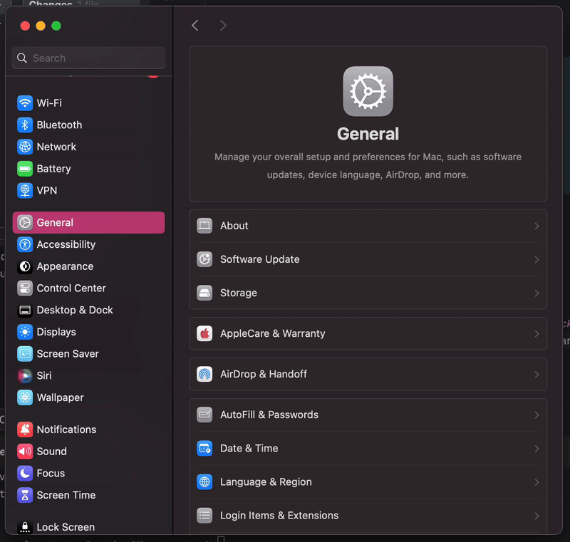
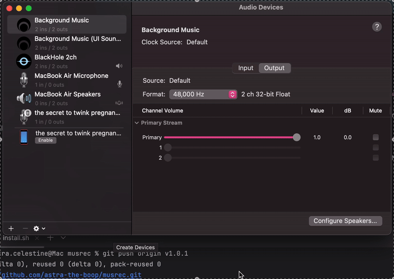
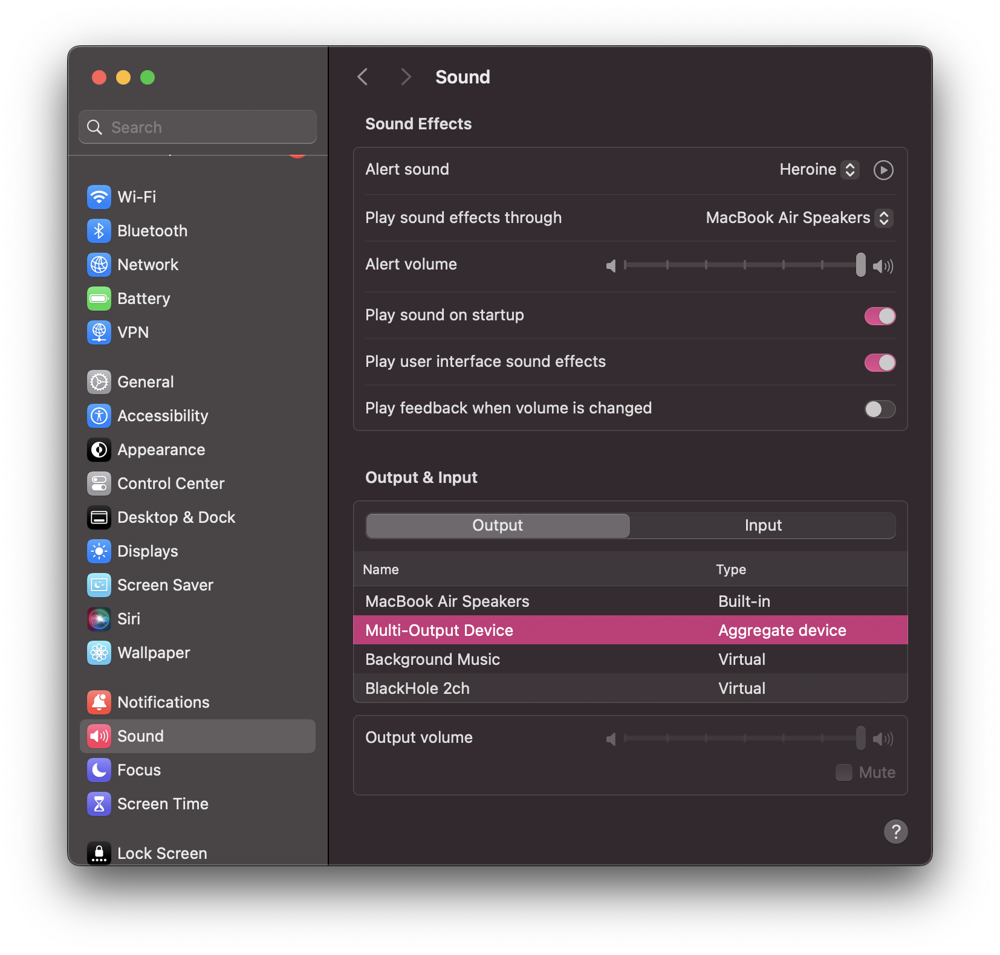

# MusRec - Records and exports music with automatic metadata tagging
## Overview / Description

MusRec is a CLI tool designed to capture music _(currently supporting Spotify and Apple Music)_, exporting to **MP3, FLAC, OGG, ALAC (m4a), or WAV** with automatic metadata tagging.

---

# Features
- Audio recording and exporting
- Supports: `.wav`, `.mp3`, `.flac`, `.ogg`, `.m4a (ALAC)`
- Automatic metadata tagging (Artist, Album, Cover art, etc...)
- Automatic ad-ignoring (Spotify)

---

# Installation and requirements

## Requirements
- Currently only supports macOS (we're working on porting to Linux soon enough, if you're on Windows, I recommend looking into Spytify)
- [BlackHole](https://github.com/ExistentialAudio/BlackHole) installed and set as output device
- `ffmpeg` and `switchaudio-osx` installed: `brew install blackhole-2ch ffmpeg switchaudio-osx`

---

## Installation
### !!! IMPORTANT: YOU NEED TO INSTALL THE NON-PYTHON DEPENDENCIES FIRST !!!
- **[BlackHole](https://github.com/ExistentialAudio/BlackHole)**
- **[ffmpeg](https://ffmpeg.org/)**
- **[SwitchAudio](https://github.com/deweller/switchaudio-osx)**

If you haven't already, install **Homebrew** first!
```shell
/bin/bash -c "$(curl -fsSL https://raw.githubusercontent.com/Homebrew/install/HEAD/install.sh)"
```

Then, install the three non-Python dependencies by running the following command!

```shell
brew install blackhole-2ch ffmpeg switchaudio-osx
```

**Afterwards, you can continue with regular installation!**

#### Option 1: From source code
```shell
git clone https://github.com/astra-the-boop/musrec.git
cd musrec
python3 -m venv .venv
source .venv/bin/activate
pip install --upgrade pip
pip install .
chmod +x .venv/bin/musrec
sudo ln -sf "$PWD/.venv/bin/musrec" /usr/local/bin/musrec
pip install --force-reinstall .
```

#### Option 2: Via PyPI (CURRENTLY DOESN'T WORK AS OF JUN 25)
```shell
pip3 install musrec
```

---

## User Guide

### Recording music:

Make sure you have the official Spotify or (Apple) Music app installed and ready to play!

`musrec record ...`

- `-f` / `--format`: Output format _(`wav`, `mp3`, `flac`, `ogg`)_
- `-tc` / `--trackcount`: Number of tracks you want to record
- `-s` / `--service`: Which streaming service you're using _(default: Spotify)_
- `-o` / `--outputdir`: The directory you're exporting music to _(e.g.: `"~/music export"`)_
- `-da` / `--disableadskip`: Disables automatic ad-skipping. Useful when our automatic detector isn't cutting it or if you want to record the ads for some reason.
- `-br` / `--bitrate`: Sets the bitrate for the `.mp3` export if you're exporting to `.mp3`
- `-fr` / `--force`: Skips warnings in case if our audio loopback detectors aren't working as intended
- `-b` / `--blocksize`: Sets the block-size
- `-sr` / `--samplerate`: Sets the sample rate

If you don't use any of these, they will use the default values. You can check by running `musrec --help`

Example:
```shell
musrec record -f flac -tc 50 -s apple-music -o ~/Desktop/"music export"
```

### Configuration
If you want to change the default values, you can use `config`!

`musrec config ...`
- `--set key=value`: Sets a value
- `--show`: Shows current configuration
- `--reset`: Resets to original default config

Example:
```shell
musrec --set trackCount=100
```

Value list:
```shell
    "outputFormat":"wav",
    "sampleRate":16000,
    "channels":2,
    "blockSize":1024,
    "adSkip":1,
    "outputDir":".",
    "trackCount":10,
    "service":"spotify",
    "bitrate":"320k"
```

---

## Note:

### Audio Output must be set to BlackHole or a Multi-output device with BlackHole

After installing BlackHole, go into `System Settings > Sound > Output` and change the output to BlackHole



If you want to listen to your music / audio while recording, you can create a Multi-Output Device with both BlackHole and your speaker in `Audio MIDI Setup` and setting your audio output to that





---

## Demo
[Demo Video — Spotify](https://youtu.be/P_YUd3iGAog)